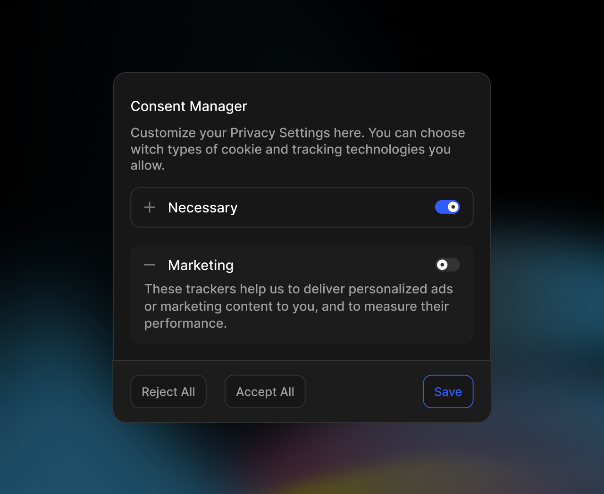

The Consent Manager Dialog provides a clean, focused way for users to customize their privacy preferences. Think of it as a spotlight that dims the rest of your application while users make important privacy decisions. When users click "Customize" on your cookie banner, this dialog smoothly appears with detailed privacy controls.



## How It Works

The dialog acts as a wrapper around the Consent Manager Widget, adding several key features:
1. A smooth fade-in animation that draws attention to privacy settings
2. An overlay that dims the rest of the application
3. Proper focus management for accessibility
4. Automatic portal rendering to avoid layout issues
5. Smart handling of mounting and unmounting

Let's explore how to implement this in your application.

## Quick Start

First, install the package if you haven't already:

<Tabs groupId="manual-install" items={["npm", "pnpm", "yarn", "bun"]}>
  <Tab value="npm">
  ```bash 
  npm install @koroflow/elements
  ```
  </Tab>
  <Tab value="pnpm">
  ```bash 
  pnpm install @koroflow/elements
  ```
  </Tab>
  <Tab value="yarn">
  ```bash
  yarn add @koroflow/elements
  ```
  </Tab>
  <Tab value="bun">
  ```bash
  bun add @koroflow/elements 
  ```
  </Tab>
</Tabs>


Then add the dialog to your application:

```tsx
import { ConsentManagerDialog } from '@koroflow/elements/consent-manager'
import { ConsentManagerProvider } from '@koroflow/elements/headless'
function App() {
  return (
    <ConsentManagerProvider>
      <YourApp />
      <ConsentManagerDialog />
    </ConsentManagerProvider>
  )
}
```

The dialog will automatically:
- Mount itself correctly in the DOM
- Handle animations smoothly
- Manage focus when opened
- Maintain accessibility standards

## Understanding Animations

The dialog uses thoughtful animations to create a polished user experience. When opened, it:
1. Fades in an overlay to dim the background
2. Scales and fades in the dialog content
3. Smoothly reverses these animations when closing

You can control this behavior with the `disableAnimation` prop:

```tsx
// Disable animations if needed
<ConsentManagerDialog disableAnimation />
```

## Customizing Appearance

The dialog supports two main approaches to styling:

### Using Themes

Apply custom styles through the theme prop:

```tsx
<ConsentManagerDialog
  theme={{
    "consent-manager-widget.root": "",
	  "consent-manager-widget.branding": "",
	  "consent-manager-widget.footer": "",
	  "consent-manager-widget.footer.sub-group": "",
		"consent-manager-widget.footer.reject-button": "",
		"consent-manager-widget.footer.accept-button": "",
		"consent-manager-widget.footer.customize-button": "",
		"consent-manager-widget.footer.save-button": "",
		"consent-manager-widget.accordion": "",
		"consent-manager-widget.accordion.trigger": "",
		"consent-manager-widget.accordion.trigger-sub-group": "",
		"consent-manager-widget.accordion.item": "",
		"consent-manager-widget.accordion.icon": "",
		"consent-manager-widget.accordion.arrow.open": "",
		"consent-manager-widget.accordion.arrow.close": "",
		"consent-manager-widget.accordion.content": "",
		"consent-manager-widget.accordion.content-inner": "",
		"consent-manager-widget.switch": "",
		"consent-manager-widget.switch.track": "",
		"consent-manager-widget.switch.thumb": "",
		"consent-manager-widget.dialog": "",
		"consent-manager-widget.dialog.root": "",
		"consent-manager-widget.dialog.header": "",
		"consent-manager-widget.dialog.title": "",
		"consent-manager-widget.dialog.description": "",
		"consent-manager-widget.dialog.content": "",
		"consent-manager-widget.dialog.footer": "",
		"consent-manager.overlay": "",
  }}
/>
```

### Removing Default Styles

For complete styling control, disable the default styles:

```tsx
<ConsentManagerDialog noStyle />
```

This gives you a blank canvas to build upon while maintaining the dialog's functionality.

## Integration Examples

### With Custom Trigger Button

```tsx
function PrivacyCenter() {
  const consentManager = useConsentManager()
  
  return (
    <button
      onClick={() => consentManager.setIsPrivacyDialogOpen(true)}
      className="privacy-button"
    >
      Privacy Settings
    </button>
  )
}
```

### With Cookie Banner

```tsx
<CookieBanner
  customizeButtonText="Privacy Preferences"
  onCustomize={() => consentManager.setIsPrivacyDialogOpen(true)}
/>
```

## Accessibility Features

The dialog implements several accessibility best practices:

### Focus Management
When the dialog opens, it:
1. Traps focus within the dialog
2. Sets initial focus on the first interactive element
3. Remembers and restores the previous focus position when closed

### Keyboard Navigation
Users can:
- Close the dialog with the Escape key
- Navigate controls with Tab
- Interact with all elements using only the keyboard

### Screen Readers
The dialog announces itself appropriately with:
- Proper ARIA roles and attributes
- Clear labeling of controls
- Status updates when opened/closed

## Technical Details

### Portal Rendering

The dialog uses React's createPortal to render outside your main application hierarchy. This ensures:
- No CSS specificity conflicts
- Proper stacking context
- Clean DOM structure

### Client-side Only

To prevent hydration issues, the dialog only renders on the client side. This is handled automatically through the `isMounted` state.

## API Reference

### Props

| Prop | Type | Description | Default |
|------|------|-------------|---------|
| theme | ConsentManagerWidgetTheme | Theme configuration | {} |
| disableAnimation | boolean | Turns off animations | false |
| noStyle | boolean | Removes default styles | false |

### Theme Properties

| Property | Purpose | Example Value |
|----------|---------|---------------|
| dialog | Main dialog container | "fixed inset-0" |
| overlay | Background overlay | "bg-black/50" |
| content | Dialog content wrapper | "bg-white p-4" |

## Best Practices

1. **Performance**
   - Only import the dialog where needed
   - Consider lazy loading if not immediately required
   - Use the disableAnimation prop on lower-end devices

2. **User Experience**
   - Keep the dialog focused on privacy settings
   - Provide clear save/cancel actions
   - Maintain consistent styling with your application

3. **Accessibility**
   - Test with keyboard navigation
   - Verify screen reader announcements
   - Ensure sufficient color contrast

## Related Components

- [Cookie Banner](/docs/guides/cookie-banner) - Initial privacy notice
- [Consent Manager Widget](/docs/guides/consent-manager-widget) - Detailed controls
